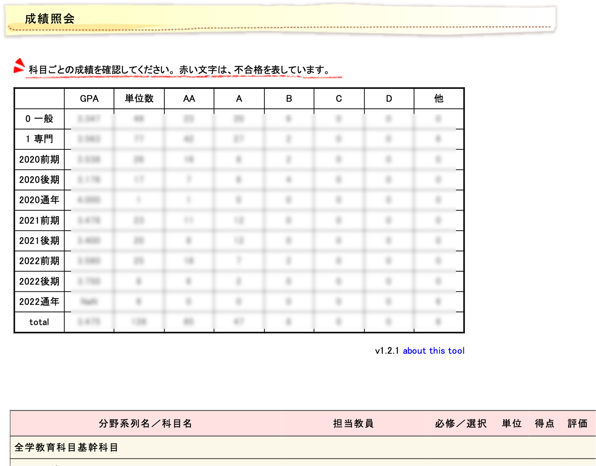

# TohokuGPA

学務情報システムの成績ページにGPAの計算結果を出力するChrome拡張機能です．

## 1. 実行方法
1. 学務情報システムにログインする．
2. 成績のページにアクセスする．
3. 勝手にGPAの計算結果が表示される．

## 2. 導入方法
1. [Releases](https://github.com/gokamoda/TohokuGPA-ChromeExtension/releases)から、最新版をダウンロードします。
2. 導入方法は各版の説明欄で説明しています。